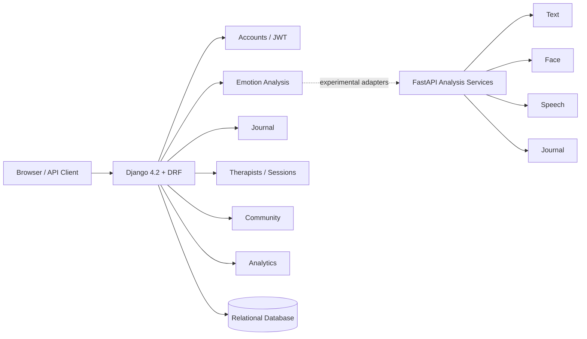

<div align="center">

# MoodSphere

### Django / DRF Mental-Wellness Platform with Emotion, Journal & Therapy Workflows

**Python · Django 4.2 · Django REST Framework · JWT · PostgreSQL/MySQL-ready persistence · FastAPI service prototypes**

</div>

---

## Overview

MoodSphere is a software-engineering project exploring mental-wellness workflows through a Django web application and REST API.

The repository contains modules for:

- user accounts and JWT authentication
- emotion-analysis records
- journal entries
- therapist directory / therapy-session workflows
- community features
- analytics and mood-trend views
- dashboard and web templates
- experimental FastAPI analysis services for text, face, speech, and journal processing

> **Health disclaimer:** MoodSphere is an educational software project. It is not a medical device, diagnosis tool, crisis service, or substitute for a qualified mental-health professional.

## Architecture



## Technology Stack

| Area | Technology |
|---|---|
| Backend | Python, Django 4.2 |
| API | Django REST Framework |
| Authentication | SimpleJWT |
| Filtering / CORS | django-filter, django-cors-headers |
| Relational DB support | PostgreSQL driver + local DB configuration |
| Additional data tooling | PyMongo, pandas, NumPy |
| UI | Django templates, Crispy Forms / Bootstrap |
| Experimental services | FastAPI-oriented analysis modules |
| Production server | Gunicorn |
| Static serving | WhiteNoise |

## Main Domains

The Django URL configuration exposes:

- `/api/auth/` — account workflows
- `/api/auth/token/` — JWT token acquisition
- `/api/analysis/` — emotion-analysis API
- `/api/journal/` — journal API
- `/api/therapists/` — therapist API
- `/api/sessions/` — therapy-session API
- `/dashboard/` — authenticated dashboard
- `/community/` — community workflows
- `/analytics/` — trend/analytics views

## Repository Structure

```text
moodsphere_project/
├── moodsphere/
│   ├── accounts/
│   ├── analysis/
│   ├── analytics/
│   ├── community/
│   ├── core/
│   ├── journal/
│   ├── therapy/
│   ├── fastapi_services/
│   ├── templates/
│   └── manage.py
├── requirements.txt
├── .env.example
└── .gitignore
```

## Security & Public-Repository Hygiene

The current codebase requires the Django secret through environment configuration and no longer uses the previously hard-coded development secret fallback.

Repository hygiene rules now exclude:

- real `.env` files
- virtual environments
- local SQLite files
- logs and generated artifacts

Credentials that were ever committed should be treated as compromised and rotated before reuse.

## Local Development

```bash
python -m venv .venv
# Windows
.venv\Scripts\activate

pip install -r requirements.txt
copy .env.example .env
cd moodsphere
python manage.py migrate
python manage.py runserver
```

## Engineering Evidence

This repository demonstrates:

- Django application modularization
- REST API routing with DRF routers
- JWT authentication
- multiple domain modules
- server-rendered dashboard/community pages
- analytics-oriented workflows
- experimentation with separate analysis-service boundaries

It is supporting engineering evidence rather than a currently featured flagship project.

## Author

**Shahriyar Khan**  
Software Engineer · Full-Stack Python Developer

- Portfolio: https://shahriyarkhan.com
- GitHub: https://github.com/Shahriyar-Kh
- LinkedIn: https://www.linkedin.com/in/shahriyar-khan-developer/

